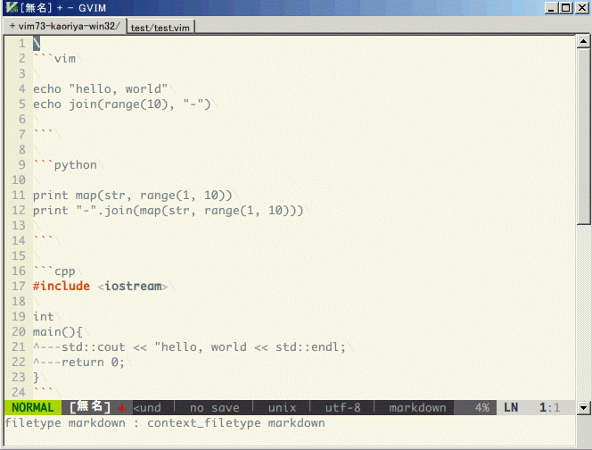

#precious.vim

現在のカーソル位置のコンテキストによって filetype を切り換える為のプラグインです。


##Requirement

* [context_filetype.vim](https://github.com/Shougo/context_filetype.vim)
* [vim-textobj-user](https://github.com/kana/vim-textobj-user)
 * textobj を使用したい時のみ必要。


##Screencapture



##Supported
* c
 * masm
 * gas
* cpp
 * masm
 * gas
* d
 * masm
* eruby
 * ruby
* help
 * vim
* html
 * javascript
 * coffee
 * css
* int-nyaos
 * lua
* lua
 * vim
* nyaos
 * lua
* perl16
 * pir
* python
 * vim
* vim
 * python
 * ruby
 * lua
* vimshell
 * vim
* xhtml
 * javascript
 * coffee
 * css
* markdown


##Example

```vim
" test.vim
" set filetype=vim --------------------------------------------------
echo "hello, world"


" set filetype=ruby -----------------------------
ruby << EOF

result = (1..10).map(&:to_s).join("-")
puts result

EOF
"---------------------------------------------------------


" set filetype=python ----------------------------
python << EOF

print map(str, range(1, 10))
print "-".join(map(str, range(1, 10)))

EOF
"---------------------------------------------------------

echo join(range(10), "-")


" autocmd
" コンテキストに入った時の処理をフック
augroup test
	autocmd!
	autocmd User PreciousFileType      :echo precious#context_filetype()
	" ruby のコンテキストに入った時に tabstop を設定する
	autocmd User PreciousFiletype_ruby :PreciousSetContextLocal tabstop=8
augroup END


" insert mode に入った時に 'filetype' を切り換える。
" カーソル移動時の自動切り替えを無効化
" let g:precious_enable_switch_CursorMoved = {
" \	"*" : 0
" \}
" let g:precious_enable_switch_CursorMoved_i = {
" \	"*" : 0
" \}
" 
" " insert に入った時にスイッチし、抜けた時に元に戻す
" augroup test
" 	autocmd!
" 	autocmd InsertEnter * :PreciousSwitch
" 	autocmd InsertLeave * :PreciousReset
" augroup END


" quickrun.vim との連携
" <Space>qic で quickrun.vim する
" ただし、この場合 switchers の "setfiletype" が有効になっている必要が
" あります
" nmap <Space>q <Plug>(quickrun-op)
" omap ic <Plug>(textobj-precious-i)
" vmap ic <Plug>(textobj-precious-i)
"------------------------------------------------------------------------------
```


##Implementations

* コンテキストに入った時に自動的に filetype を切り換える
* コンテキストが切り替わった時に autocmd User で処理がフック出来る
* コンテキストの範囲の textobj に対応
* quickrun.vim との連携
 * コンテキストの範囲を quickrun する


##TODO

* matcher、switcher を使用した機能の拡張
* matcher、switcher の優先順位付け
* コンテキストの範囲を取得


